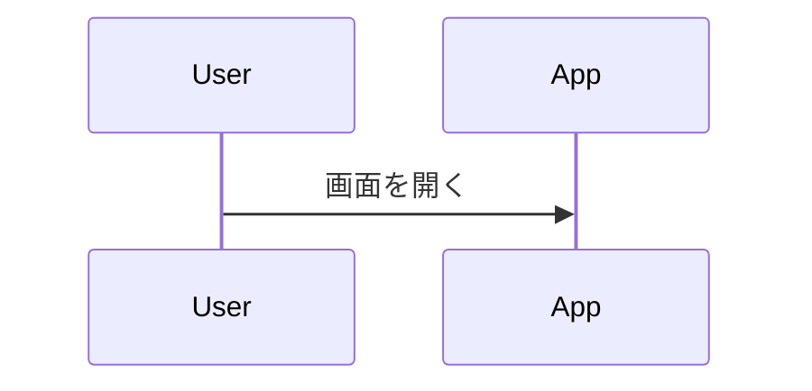

# HTML/Markdown Converter
HTML/Markdown Converter is a client-side web application built with HTML5, CSS3, and JavaScript that converts between HTML and Markdown formats. The application produces clean output without unnecessary styles, classes, or attributes.

**ALWAYS follow these instructions first and fallback to search or bash commands only when you encounter unexpected information that does not match the info here.**

## Working Effectively
- Install dependencies:
  - `npm install` -- takes ~1 second. NEVER CANCEL. Dependencies are minimal (only turndown.js).
- Run the application:
  - `python3 -m http.server 8080` -- starts immediately. NEVER CANCEL. Keep server running during development.
  - Open http://localhost:8080 in browser to access the application.
- Alternative serving methods:
  - Direct file access: Open `index.html` directly in browser (file:// protocol).
  - Any static file server: `npx serve .` or equivalent.

## Validation
- **CRITICAL**: ALWAYS test functionality manually in a browser with unrestricted internet access after making changes.
- **NEVER SKIP MANUAL TESTING**: Automated tests cannot validate the full user experience.
- ALWAYS test both conversion directions:
  1. HTML → Markdown conversion: Input `<h1>Test</h1><p>Hello <strong>world</strong></p>` → Expected output `# Test\n\nHello **world**`
  2. Markdown → HTML conversion: Input `# Test\n\nHello **world**` → Expected output contains `<h1>Test</h1><p>Hello <strong>world</strong></p>`
- ALWAYS test UI interactions:
  - Keyboard shortcuts: Ctrl+Enter for quick conversion
  - Copy button functionality (requires HTTPS or localhost)
  - Clear button functionality
  - Radio button switching between conversion modes
- Manual testing scenarios with `Samples/sample.md`:
  - Convert Japanese text, Mermaid diagrams, code blocks, tables
  - Verify preview rendering works with syntax highlighting
  - Test responsive design on different screen sizes
- **CDN Dependency Testing**: In restricted environments, expect console errors but UI should still be functional for basic interactions.

## Dependencies and Limitations
- **CRITICAL CDN DEPENDENCY LIMITATION**: External CDN dependencies are blocked in some environments:
  - Turndown.js (HTML to Markdown) - has local fallback in `node_modules/turndown/dist/turndown.js`
  - Markdown-wasm (Markdown to HTML) - CDN only, no local fallback
  - Mermaid.js (diagram rendering) - CDN only, no local fallback
  - PrismJS (syntax highlighting) - CDN only, no local fallback
- **When CDN is blocked**: Basic UI works but conversion functionality is limited
- **Full functionality requires**: Unrestricted internet access to CDN resources
- **No build process required**: Application runs directly from source files

## Common Tasks
The following are outputs from frequently run commands. Reference them instead of viewing, searching, or running bash commands to save time.

### Repository Structure
```
.
├── index.html          # Main application file - UI and structure
├── script.js           # Core conversion logic and event handlers  
├── style.css           # Application styling and responsive design
├── package.json        # Dependencies (turndown.js only)
├── README.md           # Project documentation
├── LICENSE             # MIT license
├── Samples/
│   └── sample.md       # Sample Markdown content for testing
└── node_modules/       # Installed dependencies
    └── turndown/       # Local HTML to Markdown converter
```

### Key Files and Their Purpose
- **index.html**: Contains the user interface, form controls, and CDN library imports
- **script.js**: Implements conversion logic, UI event handlers, and library configurations
- **style.css**: Defines modern, responsive styling with CSS variables
- **Samples/sample.md**: Rich test content including Mermaid diagrams, code blocks, tables

### Package.json Contents
```json
{
  "dependencies": {
    "turndown": "^7.2.0"
  }
}
```

## Validated Commands and Expected Results
**All commands below have been tested and verified to work correctly:**

### Installation and Setup
```bash
# Install dependencies (takes ~1 second)
npm install
# Expected: "audited 3 packages" with no vulnerabilities

# Start development server (immediate)
python3 -m http.server 8080
# Expected: "Serving HTTP on 0.0.0.0 port 8080"
```

### File Structure Verification
```bash
# Repository overview
ls -la
# Expected: index.html, script.js, style.css, package.json, README.md, LICENSE, Samples/, node_modules/

# Check dependencies
ls node_modules/
# Expected: @mixmark-io/, turndown/

# Sample content location
ls Samples/
# Expected: sample.md
```

### Application Access
- **Primary URL**: http://localhost:8080
- **Expected**: Clean, responsive interface with conversion controls
- **File Protocol**: Open `index.html` directly (limited CDN access)

### CDN Status Verification
When CDN access is **available**:
- No console errors related to library loading
- Full conversion functionality works
- Preview panel shows rendered content with syntax highlighting

When CDN access is **blocked**:
- Console errors: "TurndownService is not defined", "markdown is not defined"  
- UI remains functional: radio buttons, clear button work
- Conversion functionality disabled
- This is **expected behavior** in restricted environments

### Testing the Application
**MANDATORY VALIDATION STEPS** - Execute ALL steps after making ANY changes:

1. **Environment Setup**:
   - `npm install` (completes in ~1 second)
   - `python3 -m http.server 8080` (starts immediately)
   - Open http://localhost:8080 in browser

2. **Functional Testing** (requires unrestricted internet access):
   - **HTML → Markdown Test**:
     - Select "HTML → Markdown" radio button
     - Input: `<h1>Test</h1><p>Hello <strong>world</strong></p>`
     - Press Ctrl+Enter or click Convert
     - Expected output: `# Test\n\nHello **world**`
   - **Markdown → HTML Test**:
     - Select "Markdown → HTML" radio button  
     - Input: `# Test\n\nHello **world**`
     - Press Ctrl+Enter or click Convert
     - Expected output: `<h1>Test</h1><p>Hello <strong>world</strong></p>`

3. **UI Interaction Testing**:
   - Test keyboard shortcut: Ctrl+Enter in input field triggers conversion
   - Test copy button: Click "Copy" and verify clipboard content
   - Test clear button: Click "Clear" and verify both fields empty
   - Test radio button switching: Labels should update when switching modes

4. **Advanced Content Testing**:
   - Use content from `Samples/sample.md` (Japanese text, Mermaid diagrams, code blocks)
   - Verify complex HTML structures convert cleanly
   - Test responsive design by resizing browser window

5. **Browser Console Validation**:
   - **With internet access**: No JavaScript errors
   - **With CDN blocked**: Expect TurndownService/markdown undefined errors, but UI should remain functional

6. **Cross-browser Testing**:
   - Test in Chrome, Firefox, Safari (if available)
   - Verify consistent behavior across browsers

## Common Tasks
Reference these frequently used outputs to save time instead of running bash commands:

### Repository Structure
```
.
├── .github/
│   └── copilot-instructions.md  # This file
├── .gitignore
├── LICENSE                     # MIT license
├── README.md                   # Project documentation
├── Samples/
│   └── sample.md              # Rich test content (Japanese, Mermaid, code)
├── index.html                 # Main application file - UI and structure
├── node_modules/              # Dependencies (turndown.js)
├── package-lock.json
├── package.json               # Dependencies manifest
├── script.js                  # Core conversion logic and event handlers
└── style.css                  # Modern responsive styling with CSS variables
```

### Key Development Files
- **index.html**: UI layout, form controls, CDN library imports, accessibility features
- **script.js**: TurndownService configuration, conversion logic, event handlers, clipboard API
- **style.css**: CSS variables, responsive design, modern styling, mobile support
- **Samples/sample.md**: Test content with Japanese text, Mermaid diagrams, code blocks, tables

### Sample Test Content (from Samples/sample.md)
```markdown
# サンプル Markdown
段落。**強調** や *斜体*、`インラインコード`。

## リスト
- りんご
- バナナ  
- みかん

## コード
```js
const msg = 'Hello Prism!';
console.log(msg);
```

## Mermaid 図


### Development Workflow
1. **Edit source files**: Make changes to HTML, CSS, or JavaScript
2. **Refresh browser**: No build step required - changes reflect immediately  
3. **Test manually**: Run through conversion scenarios
4. **Validate UI**: Check responsive design and accessibility
5. **Console check**: Verify no new JavaScript errors introduced

### Application Features
- Bidirectional conversion between HTML and Markdown
- Clean output without CSS classes, styles, or JavaScript
- Copy to clipboard functionality with visual feedback
- Keyboard shortcuts (Ctrl+Enter for conversion)
- Responsive design for mobile and desktop
- Real-time conversion without page reload
- Support for tables, code blocks, emphasis, links, lists

### CDN Dependencies Status
When CDN access is available:
- Turndown.js: HTML to Markdown conversion ✓
- Markdown-wasm: Markdown to HTML conversion ✓  
- Mermaid.js: Diagram rendering in preview ✓
- PrismJS: Syntax highlighting in preview ✓

When CDN access is blocked:
- HTML to Markdown: Use local fallback (modify script.js to use `/node_modules/turndown/dist/turndown.js`)
- Markdown to HTML: Limited functionality
- Preview features: Disabled

### Performance Expectations and Timing
- **npm install**: ~1 second (minimal dependencies). NEVER CANCEL.
- **Server startup**: Immediate (Python HTTP server). NEVER CANCEL.
- **Page load**: <1 second (simple static files)
- **Conversion**: Instant (client-side processing when CDN accessible)
- **No build time**: Application runs directly from source files
- **File operations**: All file edits reflect immediately on browser refresh

### Known Issues and Workarounds
- **CDN Blocking**: In restricted environments, external libraries fail to load
  - **Symptom**: Console errors "TurndownService is not defined"
  - **Impact**: Conversion functionality disabled, UI remains interactive
  - **Workaround**: Test in environment with unrestricted internet access
- **HTTPS Required**: Clipboard API requires secure context
  - **Solution**: Use localhost (secure context) or HTTPS deployment
- **No Linting Tools**: No ESLint, Prettier, or other code quality tools configured
  - **Manual validation required**: Check code syntax and formatting manually

### Browser Compatibility
- Modern browsers with ES6+ support
- Clipboard API requires secure context (HTTPS/localhost)
- Responsive design works on mobile devices
- No Internet Explorer support (uses modern JavaScript features)