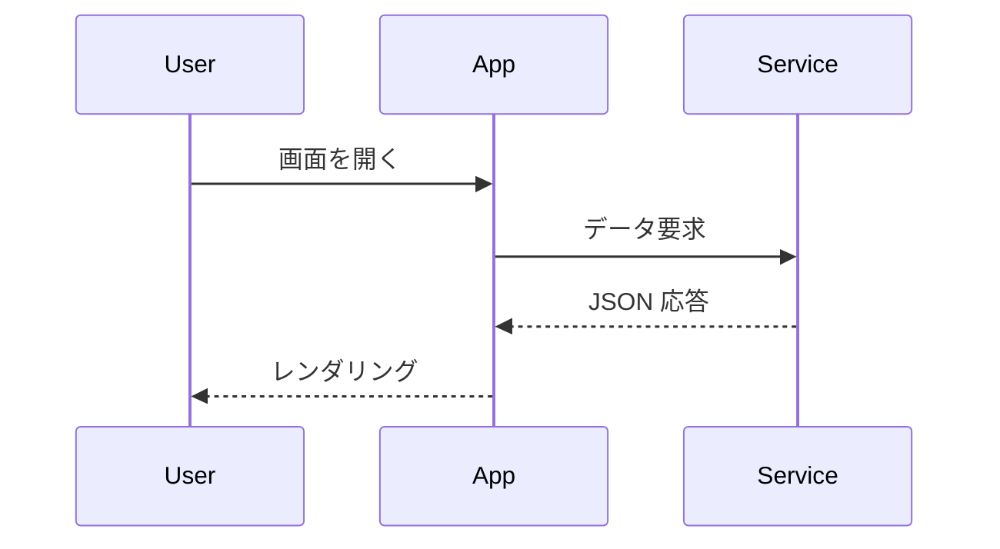
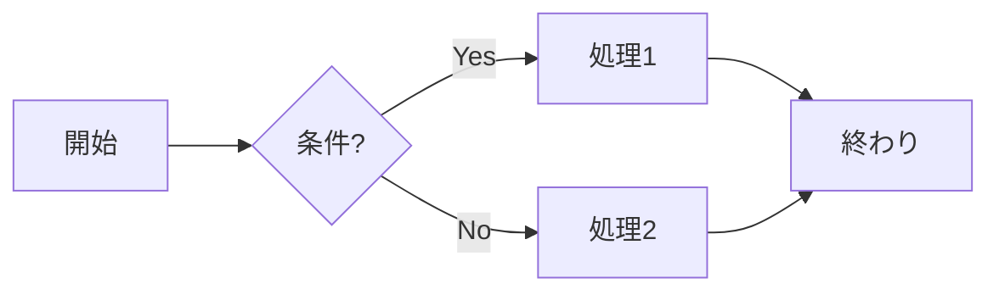
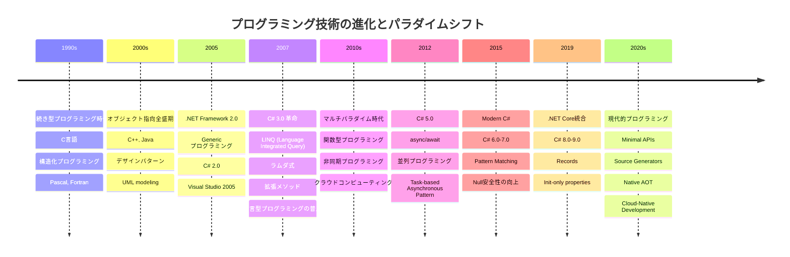

# サンプル Markdown

以下は機能サンプルです。

## 通常テキスト

段落。**強調** や *斜体*、`インラインコード`。

## リンク

[内部リンク](#part1)
[Google Map](https://www.google.co.jp/maps/)
[Yahoo!](https://www.yahoo.co.jp)

<a id = "part1">内部リンク</a>

## 画像


## リスト

- りんご
- バナナ
- みかん

1. 番号付き
2. リスト

## コード (Prism ハイライト)

```js
// JavaScript サンプル
const msg = 'Hello Prism!';
console.log(msg);
function fib(n){return n<2?n:fib(n-1)+fib(n-2)}
```

## Mermaid 図







## 表

| 項目 | 値 |
|------|----|
| A    | 10 |
| B    | 20 |

## 引用

> 引用ブロック

## 数式

**ベクトルの絶対値**
```math
\vec{a} = (x, y)
```
```math
\lvert \vec{a} \rvert = \sqrt{x^2+y^2} \
```

**2点 a とb の距離 d**
```math
d = \lvert \vec{a} - \vec{b} \rvert
```

## 終わり

以上。
